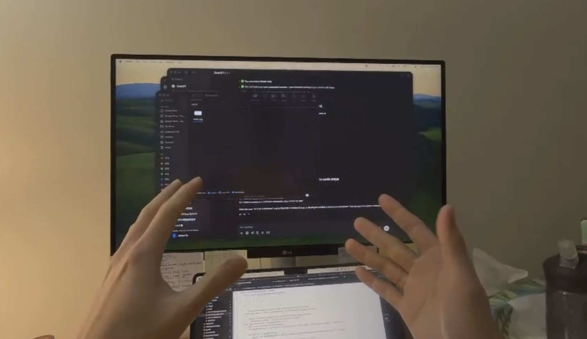

# Apple Vision Pro Composite View Capture 

### What is this repo for?

Use a programmatic way to capture composite views in Apple Vision Pro (AVP). 


### Workflow

1. In your Macbook, grant Access in System - Privacy - Accessibility for your terminal or IDE (VSCode or Cursor)

2. Open Developer Capture Tools in Reality Composer Pro (More Info [here](https://developer.apple.com/documentation/visionos/capturing-screenshots-and-video-from-your-apple-vision-pro-for-2d-viewing), recommend to read)

   

3. Make sure your laptop is connected successfully to the Apple Vision Pro

4. Follow the steps in **Features** and **Run** the script `main.py`

5. Make sure the Developer Capture Tool is the main current task in you Macbook. This can be done easily by clicking on the developer tool window.

6. Click the key "A" on your keyboard manually. (PS: this step can be replaced by a websocket message control or other advanced tricks later). 

7. After 3 seconds, the script will simulate a click event and click the space key. 

8. Then the developer capture tool will capture the current composite view in AVP and save to the `\Desktop` folder.

9. Take this image for any processing (inference on your MacBook or send to other servers)

### Features

1. Using a programmatic way to trigger composite view screenshot capture/screen recording
2. Do not require Apple Vision Pro Enterprise License
3. No Unity or its package and plugin
4. No Xcode or Swift UI, only MacBook / Reality Composer Pro / Apple Vision Pro needed + this little magic script
5. Can be interfaced with WebSockets later to allow for XR headset control and cross-device control
6. image/video files will be directly saved on the MacBook/Desktop folder and can be processed in any AI model or transferred to a server easily, much easier than sending from an XR headset, friendly for non-on-device inference

### Install

```bash
conda create -n avp_capture python=3.11 -y
conda activate avp_capture
python -m pip install --upgrade pip
python -m pip install -r requirements.txt
```

### Run

```bash
python main.py
```

### Others

The code for space in MacOS is 49.

### More Info

In Apple Vision Pro Enterprise API, there is an entitlement called “Passthrough in screen capture – Access a composite feed of what an Apple Vision Pro wearer is seeing (physical world and digital content). [[Link]](https://developer.apple.com/documentation/BundleResources/Entitlements/com.apple.developer.screen-capture.include-passthrough)”

However, it is difficult to know how to use this entitlement to actually capture the screen views in Apple Vision Pro.

What's worse, if you XR application needs to deal with Unity and Swift UI scripting layer, using any Apple Enterprise API will be even more troublesome.

Existing sample code in GitHub mainly just showcases how to get the main camera view in Apple Vision Pro, including
- [EnterpriseCameraAccessPlugin](https://github.com/styly-dev/EnterpriseCameraAccessPlugin)
- [AVPStereoCapture](https://github.com/surreality-lab/AVPStereoCapture)

However, by using this main camera access, you can only capture the **physical real-world view** without the **overlaid AR digital elements**.

We differentiate between the passthrough physical view and the composite view, composite view will contain both the passthrough view and the digital visual elements.

**Composite View**


**Physical world view**



To capture the composite view, you can only do

1. OS-level screen recording
2. (Not test yet) using Passthrough API + ReplayKit

But using the above 2 methods will not support programmatic scripting with other code logic since it will trigger OS-level operations and will interrupt the or

All the above issues cause me big headaches.

Using this method, the image and video will also be saved directly in your local Macbook, comparatively more friendly than saving in XR headset client app and then you still need to take out and transfer the large image or video data to your Macbook.

By saving on the laptop, we can alsso easily do sanity check and quick visualization to guarantee the scene image is saved correctly.

### Limitation

This method requires having Capture Tools open on your Macbook and I have not figured out a way to customized the photos or videos saving path yet. Currently, it will save to your /Desktop folder by default.

### Last Word

If you find this helpful, feel free to give me a star✨ and welcome for any comment or feedback.
I am happy to learn more abour #XR #Apple Vision Pro and their development for use with #AI pipeline.